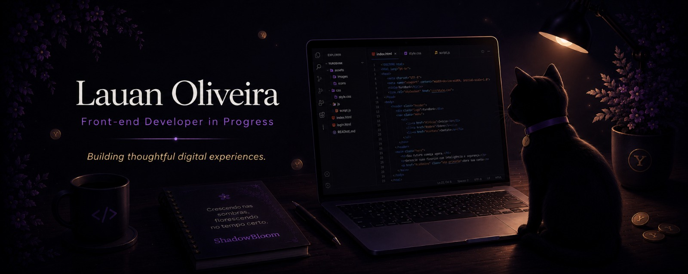

# 👋 Olá, eu sou Lauan

**Front-end Developer in Progress 🌱**

Atualmente estudo desenvolvimento web com foco em HTML, CSS e JavaScript.

Acredito que a melhor forma de aprender é construindo. Por isso gosto de transformar ideias em projetos reais, evoluindo um passo de cada vez enquanto desenvolvo minhas habilidades.

---

## 💜 Filosofia

Algumas das mudanças mais importantes acontecem em silêncio.

Continuo aprendendo, construindo e evoluindo um passo de cada vez.

Programação, idiomas e projetos pessoais têm algo em comum: todos começam com curiosidade e crescem com dedicação.

---

## ⭐ Projeto em Destaque

### 🏦 YuroBank

Banco digital fictício desenvolvido para praticar HTML, CSS e JavaScript.

Meu objetivo com o projeto foi reunir design, lógica e experiência do usuário em uma aplicação que parecesse um produto real.

**Funcionalidades:**

* Sistema de login
* Saldo dinâmico
* Extrato
* Cartão virtual
* LocalStorage
* Interface responsiva
* Mascote interativo

---

## 🌱 Minha Jornada

O ShadowBloom foi meu primeiro projeto pessoal.

Mais do que uma página web, ele representou o momento em que deixei de apenas estudar programação e comecei a transformar ideias próprias em código.

Foi nele que experimentei animações, efeitos visuais e interatividade pela primeira vez.

Depois veio o YuroBank, um projeto mais ambicioso que me permitiu explorar design, experiência do usuário e funcionalidades inspiradas em aplicações reais.

Cada projeto marca uma etapa da minha evolução como desenvolvedor e faz parte da construção da minha jornada no Front-End.

---

## 🛠️ Tecnologias

HTML • CSS • JavaScript • Git • GitHub

---

## 🌎 Além da Programação

Também estudo idiomas e gosto de aprender de forma contínua.

* 🇺🇸 Inglês
* 🇯🇵 Japonês
* 🇪🇸 Espanhol

Acredito que aprender novas linguagens, sejam elas humanas ou de programação, amplia a forma como enxergamos o mundo.

---

## 📚 Atualmente Aprendendo

* JavaScript
* Git e GitHub
* Desenvolvimento Front-end
* Inglês
* Japonês
* Espanhol

---

## 🎯 Objetivo

Busco evoluir como desenvolvedor Front-end e construir projetos cada vez mais completos enquanto me preparo para oportunidades de estágio e desenvolvimento profissional.
